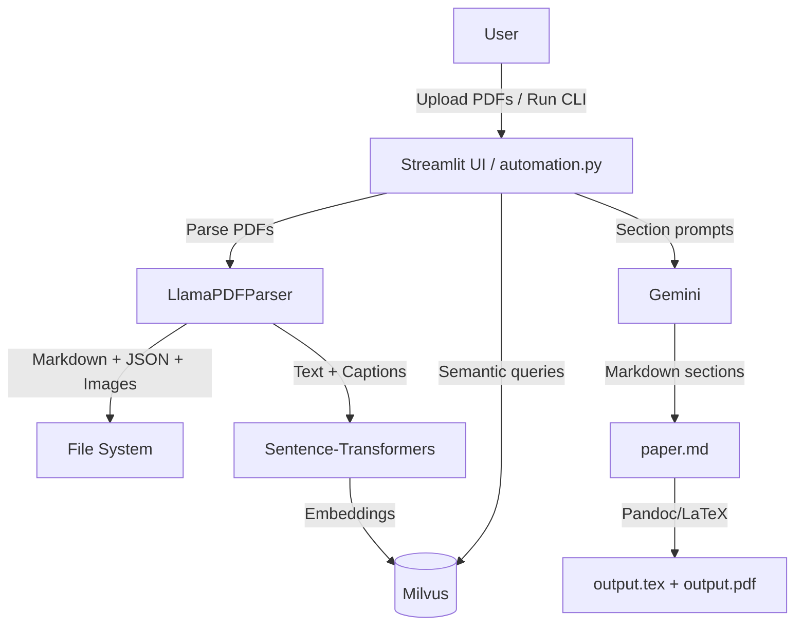

## 📄 Paper Brain
Paper Brain turns collections of PDFs into a searchable knowledge base and produces polished, paper-style summaries and question papers. It combines LlamaParse for robust PDF parsing, Milvus for vector search, and Gemini for high‑quality generation — with one-click Streamlit UI and a clean automation CLI.

### Why this is compelling
- **Multi-document to multi-section**: Abstract, Introduction, Methodology, Results, Conclusion, References — generated coherently across papers.
- **Image-aware**: Extracts figures and captions to enrich outputs.
- **Searchable memory**: Stores content embeddings in Milvus for fast semantic search and reuse.
- **Export ready**: Outputs Markdown, LaTeX, and PDF (via Pandoc/TeXLive or MiKTeX on Windows).

### Architecture


## ✨ Features at a glance
- **Summarization pipeline**: Converts PDFs → Markdown/JSON → embeddings → Gemini-written sections → LaTeX/PDF.
- **Vector search**: Milvus-backed queries across all ingested papers.
- **Image extraction**: Pulls figures and writes concise captions.
- **Two entry points**: Streamlit UI and automation CLI.

## 🔑 Prerequisites
- Python 3.10+
- Docker + Docker Compose (for Milvus)
- Pandoc
- TeX distribution
  - Windows: MiKTeX
  - macOS/Linux: TeXLive
- Accounts/API keys
  - `LLAMA_CLOUD_API_KEY` (LlamaParse)
  - `GEMINI_API_KEY` (Google AI Studio)

Create a `.env` file in the project root:
```bash
LLAMA_CLOUD_API_KEY=your_llamacloud_key
GEMINI_API_KEY=your_gemini_key
```

## 🚀 Quickstart
### 1) Start Milvus locally (Docker Compose)
```bash
docker compose up -d
```
This brings up etcd, MinIO, and Milvus. Milvus is available at `localhost:19530`.

### 2) Install Python deps
Windows (cmd or PowerShell):
```powershell
python -m venv myvenv
myvenv\Scripts\activate
pip install -r requirements.txt
```

macOS/Linux:
```bash
python -m venv myvenv
source myvenv/bin/activate
pip install -r requirements.txt
```

### 3) Run the Streamlit app
```bash
streamlit run app.py
```
- Upload PDFs, set an output directory, then Process.
- Use the Search tab to generate a paper-style summary from your query and stored content.

## 🧪 CLI usage (automation)
The same pipeline is available without the UI.

- **Ingest PDFs and index to Milvus**
```bash
python automation.py dump path\to\paper1.pdf path\to\paper2.pdf output_dir
```
This produces `output_dir/<paper>.md`, `output_dir/<paper>.json`, extracts images, and inserts embeddings into Milvus.

- **Search and generate a synthesized paper**
```bash
python automation.py search "your research question or keywords"
```
Outputs:
- `paper.md` with Abstract, Introduction, Methodology, Results, Conclusion, References
- `latex-output/output.tex` and `latex-output/output.pdf`

## 🧱 Key components
- `parser.py` — `LlamaPDFParser`: LlamaParse-backed PDF→Markdown, image extraction (PyMuPDF), heading-aware JSON, and local figure assets.
- `retrieval.py` — `MilvusEmbeddingManager`: Sentence-Transformers (`e5-large-v2`) embeddings, Milvus schema/index, semantic querying (text and content/image captions).
- `llm_prompt.py` — Structured prompts for each section (user-based, abstract, intro, methodology, results, conclusion, references, lit review, captions, Q&A generation).
- `automation.py` — Orchestration: ingest, index, query, and LaTeX/PDF generation.
- `ToLatex.py` — Markdown→LaTeX and PDF utility.
- `app.py` — Streamlit UI with live logs and collection management.
- `docker-compose.yml` — Milvus stack for local development.

## 📝 Notes and tips
- Ensure Pandoc and a TeX distribution are installed and on PATH (for PDF output). The Dockerfile includes these for containerized runs; locally you must install them.
- Milvus MinIO console is exposed at `http://localhost:9001`; Milvus health at `http://localhost:9091/healthz`.
- All embeddings default to 1024-dim `e5-large-v2`. Adjust in `retrieval.py` if you switch models.
- API keys are read from `.env` at runtime. Missing keys will raise explicit errors.

## 🧰 Optional: Build the app image
The provided Dockerfile runs the Streamlit app and bundles Pandoc/TeXLive. For most setups, running the app locally (as above) while Milvus runs via Docker is simplest. If you do containerize the app, ensure it can reach Milvus at `localhost:19530` from inside the container (networking may need adjustment).
```bash
docker build -t Paper-Brain .
docker run --env-file .env -p 8501:8501 Paper-Brain
```

## 🔍 Troubleshooting
- "API key is not set" → Check `.env` has `LLAMA_CLOUD_API_KEY` and `GEMINI_API_KEY`, and that your shell is in the project root.
- "pdflatex/pandoc not found" → Install Pandoc and a TeX distribution (MiKTeX on Windows, TeXLive on macOS/Linux) or run via the Docker image.
- "Cannot connect to Milvus" → Verify `docker compose ps`, ensure `19530` is open, and that the app is pointing to `localhost:19530`.

---

Built for pragmatic research automation: ingest, search, and publish-quality outputs with minimal friction.
